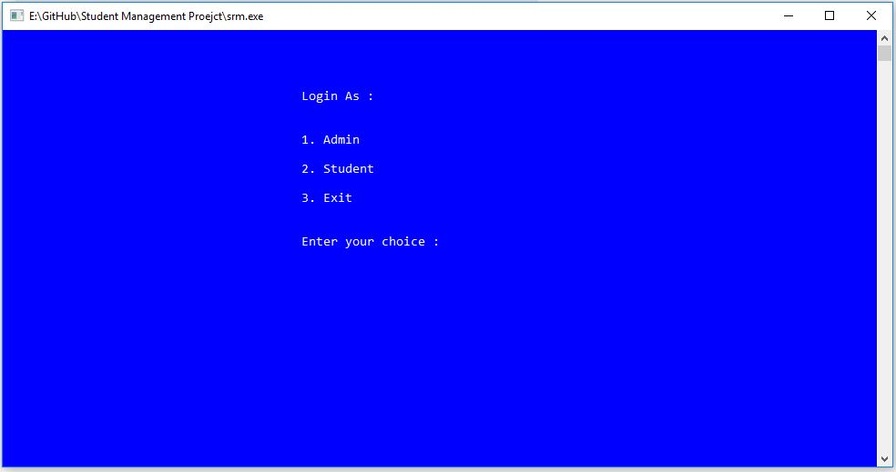
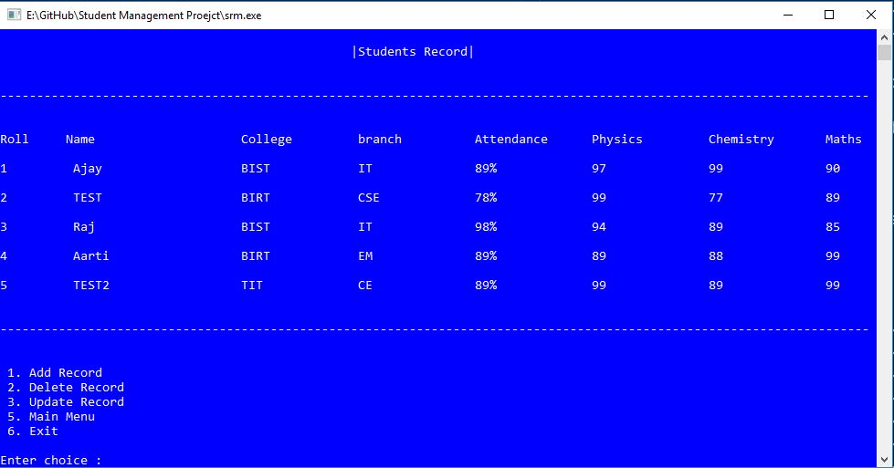
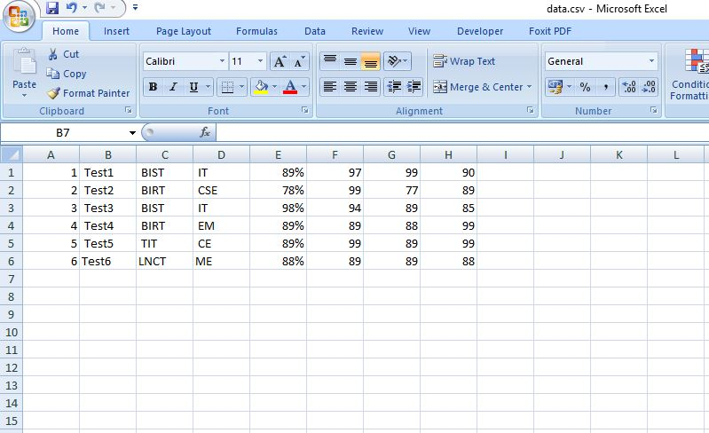

# Student Record Management System
A minimalist desktop app  to managae students record. **record are saved directly on an excel file to decrease data Entry labour cost**  and improves efficiency.

>launch the srm.exe file directly to use the App.

>for testing purpose both passwords are set to "password".

>Admin have full access to manipulate the data.

>Student account can only view the data.
## `Login`

## `Logged in as Admin`

## `Viewing Students Records`

## ``Records Saved in Excel File``

### Running on Local machine

- Install a C++ compiler (e.g., GCC).
- Write your C++ code and save it with the .cpp extension.
- Open the terminal (Linux/Mac) or Command Prompt (Windows).
- Navigate to the directory containing your C++ source code.
- Compile the code using the command: `g++ -o output_filename source_file.cpp`.
- Run the executable using: `./output_filename` (Linux/Mac) or `output_filename.exe` (Windows).
- Test and verify your program's functionality.

